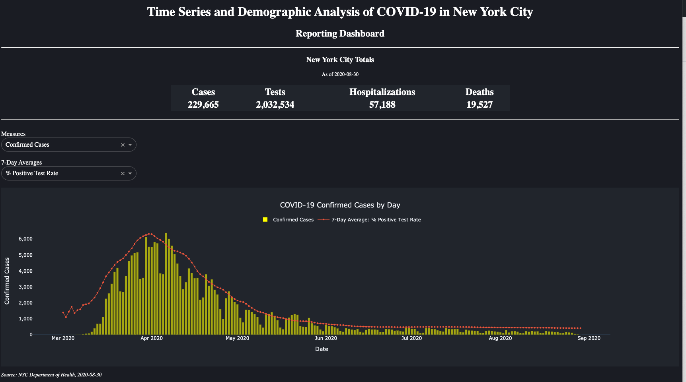

# New York City Covid-19 Dashboard
This is a dashboard higlighting trends in COVID-19 cases in NYC. The dashboard includes trends by number of confirmed cases, hospitalizations, test, deaths, and test positivity rate.

This dashboard continually queries publically available data provided by the New York City Department of Health.

## Screenshots
---

---
## Tools
Python 3
- Pandas
- Plotly
- Dash

HTML
CSS

